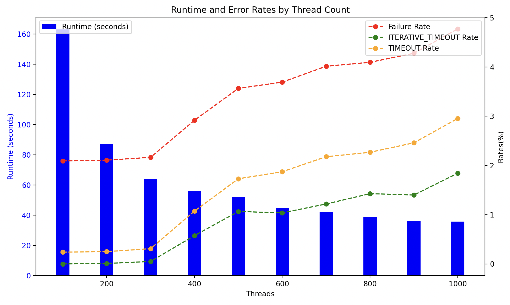

ZDNS
====

[](https://goreportcard.com/report/github.com/zmap/zdns)

ZDNS is a command-line utility that provides high-speed DNS lookups. ZDNS is
written in Go and contains its own recursive resolution code and a cache
optimized for performing lookups of a diverse set of names. We use
https://github.com/zmap/dns to construct and parse raw DNS packets.
For more information about ZDNS's architecture and performance, check out the following [paper](https://lizizhikevich.github.io/assets/papers/ZDNS.pdf) appearing at ACM's Internet Measurement Conference '22.

As an example, the following will perform MX lookups and a secondary A lookup
for the IPs of MX servers for the domains in the Alexa Top Million:

	cat top-1m.csv | ./zdns MX --ipv4-lookup --alexa


Install
=======

ZDNS can be installed by checking out the repository and running `make zdns`.

```bash
git clone https://github.com/zmap/zdns.git
cd zdns
make zdns
```

Usage
=====

ZDNS was originally built as a CLI tool only. Work has been done to convert
this [library](github.com/zmap/zdns/src/zdns) into a standalone library and let a separate [CLI](github.com/zmap/zdns/src/cli) wrap the library.

The library consists of a `ResolverConfig` struct which will contain all config options for all lookups made.
The `ResolverConfig` is used to create 1+ `Resolver` struct(s) which will make all lookups. A `Resolver`
should only make a single lookup at a time (it is not thread-safe) and multiple `Resolver` structs should be
used for parallelism. See our [examples](github.com/zmap/zdns/examples) for how to use the
library. [Modules](github.com/zmap/zdns/src/modules) are used to define the behavior of the lookups.

ZDNS provides several types of modules:

- *Raw DNS modules* provide the raw DNS response from the server similar to dig,
  but in JSON. There is a module for (nearly) every type of DNS record

- *Lookup modules* provide more helpful responses when multiple queries are
  required (e.g., completing additional `A` lookup for IP addresses if a `NS` is 
  received in `NSLOOKUP`)

- *Misc modules* provide other additional means of querying servers (e.g.,
  `bind.version`)

We detail the modules below:

Raw DNS Modules
---------------

The A, AAAA, AFSDB, ANY, ATMA, AVC, AXFR, BINDVERSION, CAA, CDNSKEY, CDS, CERT,
CNAME, CSYNC, DHCID, DMARC, DNSKEY, DS, EID, EUI48, EUI64, GID, GPOS, HINFO,
HIP, HTTPS, ISDN, KEY, KX, L32, L64, LOC, LP, MB, MD, MF, MG, MR, MX, NAPTR,
NID, NINFO, NS, NSAPPTR, NSEC, NSEC3, NSEC3PARAM, NSLOOKUP, NULL, NXT,
OPENPGPKEY, PTR, PX, RP, RRSIG, RT, SVCBS, MIMEA, SOA, SPF, SRV, SSHFP, TALINK,
TKEY, TLSA, TXT, UID, UINFO, UNSPEC, and URI modules provide the raw DNS
response in JSON form, similar to dig.

For example, the command:

	echo "censys.io" | ./zdns A

returns:
```json
{
   "name": "censys.io",
   "results": {
      "A": {
         "data": {
            "additionals": [
               {
                  "flags": "",
                  "type": "EDNS0",
                  "udpsize": 512,
                  "version": 0
               }
            ],
            "answers": [
               {
                  "answer": "104.18.10.85",
                  "class": "IN",
                  "name": "censys.io",
                  "ttl": 300,
                  "type": "A"
               },
               {
                  "answer": "104.18.11.85",
                  "class": "IN",
                  "name": "censys.io",
                  "ttl": 300,
                  "type": "A"
               }
            ],
            "protocol": "udp",
            "resolver": "[2603:6013:9d00:3302::1]:53"
         },
         "duration": 0.285295416,
         "status": "NOERROR",
         "timestamp": "2024-08-23T13:12:43-04:00"
      }
   }
}
```

Lookup Modules
--------------

Raw DNS responses frequently do not provide the data you _want_. For example,
an MX response may not include the associated A records in the additional
section requiring an additional lookup. To address this gap and provide a
friendlier interface, we also provide several _lookup_ modules: `alookup`,
`mxlookup`, and `nslookup`.

`alookup` acts similar to nslookup and will follow CNAME records.
`mxlookup` will additionally do an A lookup for the IP addresses that correspond with an exchange record.
`nslookup` will additionally do an A/AAAA lookup for IP addresses that correspond with an NS record

For example,

	echo "censys.io" | ./zdns mxlookup --ipv4-lookup

returns:
```json
{
   "name": "censys.io",
   "results": {
      "MXLOOKUP": {
         "data": {
            "exchanges": [
               {
                  "class": "IN",
                  "ipv4_addresses": [
                     "209.85.202.27"
                  ],
                  "name": "alt1.aspmx.l.google.com",
                  "preference": 5,
                  "ttl": 300,
                  "type": "MX"
               },
               {
                  "class": "IN",
                  "ipv4_addresses": [
                     "142.250.31.26"
                  ],
                  "name": "aspmx.l.google.com",
                  "preference": 1,
                  "ttl": 300,
                  "type": "MX"
               }
            ]
         },
         "duration": 0.154786958,
         "status": "NOERROR",
         "timestamp": "2024-08-23T13:10:11-04:00"
      }
   }
}
```

Other DNS Modules
-----------------

ZDNS also supports special "debug" DNS queries. Modules include: `BINDVERSION`.

Input Formats
-------------
ZDNS supports providing input in a variety of formats depending on the desired behavior.

### Basic Input

The most basic input is a list of names separated by newlines. For example:

From stdin:
```
echo "google.com\nyahoo.com" | ./zdns A
cat list_of_domains.txt | ./zdns A
```

From a file
```shell
./zdns A --input-file=list_of_domains.txt
```


### Dig-style Input
If you don't need to resolve many domains, providing the domain as CLI argument, similar to `dig`, is supported for ease-of-use.

For example:
```bash
./zdns A google.com --name-servers=1.1.1.1
````
Equivalent to `dig -t A google.com @1.1.1.1`

### Name Servers per-domain
Normally, ZDNS will choose a random nameserver for each domain lookup from `--name-servers`. If instead you want to specify
a different name server for each domain, you can do so by providing domainName,nameServerIP pairs seperated by newlines.
This will override any nameservers provided with `--name-servers`.

For example:
```
echo "google.com,1.1.1.1\nfacebook.com,8.8.8.8" | ./zdns A
```

You can see the `resolver` is as specified for each domain in the output (additionals/answers redacted for brevity):
```shell
$ echo "google.com,1.1.1.1\nfacebook.com,8.8.8.8" | ./zdns A
{"name":"google.com","results":{"A":{"data":{"additionals":...,"answers":[...],"protocol":"udp","resolver":"1.1.1.1:53"},"duration":0.030490042,"status":"NOERROR","timestamp":"2024-09-13T09:51:34-04:00"}}}
{"name":"facebook.com","results":{"A":{"data":{"additionals":[...],"answers":[...],"protocol":"udp","resolver":"8.8.8.8:53"},"duration":0.061365459,"status":"NOERROR","timestamp":"2024-09-13T09:51:34-04:00"}}}
````

Local Recursion
---------------

ZDNS can either operate against a recursive resolver (e.g., an organizational
DNS server) [default behavior] or can perform its own recursion internally. If
you are performing a small number of lookups (i.e., millions) and using a less
than 10,000 go routines, it is typically fastest to use one of the common
recursive resolvers like Cloudflare or Google. Cloudflare is nearly always
faster than Google. This is particularly true if you're looking up popular
names because they're cached and can be answered in a single round trip.
When using tens of thousands of concurrent threads, consider performing
iteration internally in order to avoid  DOS'ing and/or rate limiting your
recursive resolver.

To perform local recursion, run zdns with the `--iterative` flag. When this
flag is used, ZDNS will round-robin between the published root servers (e.g.,
198.41.0.4). In iterative mode, you can control the size of the local cache by
specifying `--cache-size` and the timeout for individual iterations by setting
`--iteration-timeout`. The `--timeout` flag controls the timeout of the entire
resolution for a given input (i.e., the sum of all iterative steps).


###
Threads, Sockets, and Performance
---------------------------------

ZDNS performance stems from massive parallelization using light-weight Go
routines. This architecture has several caveats:

* Every Go routine uses its own dedicated network socket. Thus, you need to be
  able to open as many sockets (in terms of both max file descriptors and
  ephemeral ports) as you have threads specified (via `--threads`). By default,
  ZDNS uses 1,000 threads, which is less than Linux's default max number of 1024
  open FDs. However, it is greater than Mac OS's default of 256. You can view
  the maximum number of open FDs (and thus sockets) permitted by running `ulimit -n`. If
  you want to run with a greater number of threads than this number, you need to
  increase the number of open files at the OS level. If you fail to do this,
  you'll encounter a fatal error similar to `FATA[0000] unable to create
   socketlisten udp <client IP address>:0: socket: too many open files`. If you
  want to run more threads than you have ephemeral ports available, you will need
  to use multiple client IP addresses: `--local-addr=A,B,C`.

* By default, ZDNS "reuses" UDP sockets by creating an unbound UDP socket for
  each light-weight routine at launch and using it for all queries (regardless
  of destination IP). This dramatically improves performance because ZDNS and the
  host OS don't need to setup and tear down a socket to send each individual
  packet (since DNS queries/responses tend to be one packet each).  However, this
  means that ZDNS will preallocate a socket for each thread at launch. This may not
  be optimal if you're only looking up a small number of names.  For example, if
  you only need to lookup 100 names, but use the default 1,000 threads, you'll
  bind but never use 900 UDP sockets. Instead, of worrying about recycling
  sockets, we recommend that you specify a reasonable number of threads for your
  use case (since this also foregoes any work to start those threads in the first place).
  This is why, though, you can get an error about being unable to open a large
  number of sockets even though you're only looking up a single name. If it's important
  to create a fresh socket for each query, you can disable this reuse by specifying
  `--recycle-sockets=false`.

* Go is happy to use all CPU cores that are available to it, and can use a
  tremendous amount of CPU if you specify a large number of threads. CPU is
  primarily used for parsing and JSON encoding. If you want to limit the number
  of CPU cores, you can do so by including the `--go-processes=n` flag or setting
  the `GOMAXPROCS` environment variable.

* It's difficult to recommend a precise amount of `--threads` as it depends on several
  factors. The graph below shows how a sample workflow has lower runtime but higher rates of name resolution failure as the number of threads increases.



  Much of the performance that you'll see depends on your workflow, hardware, and how many name servers the load is spread out on. If you're looking to maximize performance
  for your workflow/hardware, we recommend starting at 100 threads and increasing until you start to see an increase in name resolution failures.
  To help with this, you can use `--output-file=output.jsonl` and `grep -v "NOERROR" output.jsonl | wc -l` to count the number of names that failed to resolve.
  Flags that may be of use in tuning performance are:

  * `--timeout` The maximum amount of time ZDNS will spend on a single name
  * `--iteration-timeout` The maximum amount of time ZDNS will spend on a single iteration step (ex: resolving google.com at the .com layer)
  * `--network-timeout` The maximum amount of time ZDNS will wait for a response from a nameserver
  * `--retries=N` If a connection to a specific nameserver fails in `--iterative`, ZDNS will retry with another un-queried name server at that layer.
  Retries are per-name, so if `--retries=1` then ZDNS will retry a name against a new nameserver once during it's full iteration process. If all nameservers have been queried
  then a random nameserver will be chosen.
  * `--name-servers` The list of nameservers to use for lookups, mostly useful with `--iterative=false`


Output Verbosity
----------------

DNS includes a lot of extraneous data that is not always useful. There are four
result verbosity levels: `short`, `normal` (default), `long`, and `trace`:

* `short`: Short is the most terse result output. It contains only information about the responses
* `normal`: Normal provides everything included in short as well as data about the responding server
* `long`: Long outputs everything the server included in the DNS packet, including flags.
* `trace`: Trace outputs everything from every step of the recursion process

Users can also include specific additional fields using the `--include-fields`
flag and specifying a list of fields, e.g., `--include-fields=flags,resolver`.
Additional fields are: class, protocol, ttl, resolver, flags, dnssec.

Name Server Mode
----------------

By default ZDNS expects to receive a list of names to lookup on a small number
of name servers. For example:

```echo "google.com" | ./zdns A --name-servers=8.8.8.8,8.8.4.4```

However, there are times where you instead want to lookup the same name across
a large number of servers. This can be accomplished using _name server mode_.
For example:

```echo "8.8.8.8" | ./zdns A --name-server-mode --override-name="google.com"```

Here, every line piped in ZDNS is sent an A query for `google.com`. ZDNS also
supports mixing and matching both modes by piping in a comma-delimited list of
`name,nameServer`. For example:

```echo "google.com,8.8.8.8" | ./zdns A``` will send an `A` query for
`google.com` to `8.8.8.8` regardless of what name servers are specified by
`--name-servers=` flag. Lines that do not explicitly specify a name server will
use the servers specified by the OS or `--name-servers` flag as would normally
happen.

Querying all Nameservers
----------------
There is a feature available to perform a certain DNS query against all nameservers. For example, you might want to get the A records from all nameservers of a certain domain. To do so, you can do:

```echo "google.com" | ./zdns A --all-nameservers```

Multiple Lookup Modules
-----------------------
ZDNS supports using multiple lookup modules in a single invocation. For example, let's say you want to perform an A, 
AAAA, and MXLOOKUP for a set of domains and you want to perform them with iterative resolution. You will need to use the
`MULTIPLE` module and provide a config file with the modules and module-specific flags you want to use.

Please see `./zdns --help` and `./zdns <MODULE_NAME> --help` for Global and Module-specific options that can be used in the config file.

For example:

```
cat 1000k_domains.txt | ./zdns MULTIPLE --multi-config-file="./multiple.ini"
```
Where `multiple.ini` is a file that looks like:
```
; Specify Global Options here
[Application Options]
iterative=true
; List out modules and their respective module-specific options here. A module can only be listed once
[MXLOOKUP]
ipv4-lookup = true
; You can use default values and just list modules if you don't need to specify any options
[A]
[AAAA]
```

A sample `multiple.ini` file is provided in [github.com/zmap/zdns/cli/multiple.ini](github.com/zmap/zdns/cli/multiple.ini)

Running ZDNS
------------

By default, ZDNS will operate with 1,000 light-weight go routines. If you're
not careful, this will overwhelm many upstream DNS providers. We suggest that
users coordinate with local network administrators before performing any scans.
You can control the number of concurrent connections with the `--threads` and
`--go-processes` command line arguments. Alternate name servers can be
specified with `--name-servers`. ZDNS will rotate through these servers when
making requests. We have successfully run ZDNS with tens of thousands of
light-weight routines.

Unsupported Types
-----------------

If zdns encounters a record type it does not support it will generate an output
record with the `type` field set correctly and a representation of the
underlying data structure in the `unparsed_rr` field. Do not rely on the
presence or structure of this field. This field (and its existence) may change
at any time as we expand support for additional record types. If you find
yourself using this field, please consider submitting a pull-request adding
parser support.

Benchmark for ZDNS
------------------
There is a benchmark available in `benchmark/` that can be used to run ZDNS in a predictable fashion and print out some statistics about the run.
This can be useful for comparing performance before and after a change to ZDNS.
See more details in the [benchmark README](./benchmark/README.md).

Contributing
============

If you're interested in contributing to ZDNS, see [CONTRIBUTING](./CONTRIBUTING.md).

Contact
=======
- Please use [Github issues](https://github.com/zmap/zdns/issues) for filing bugs.

License
=======

ZDNS Copyright 2020 Regents of the University of Michigan

Licensed under the Apache License, Version 2.0 (the "License"); you may not use
this file except in compliance with the License. You may obtain a copy of the
License at http://www.apache.org/licenses/LICENSE-2.0

Unless required by applicable law or agreed to in writing, software distributed
under the License is distributed on an "AS IS" BASIS, WITHOUT WARRANTIES OR
CONDITIONS OF ANY KIND, either express or implied. See LICENSE for the specific
language governing permissions and limitations under the License.
