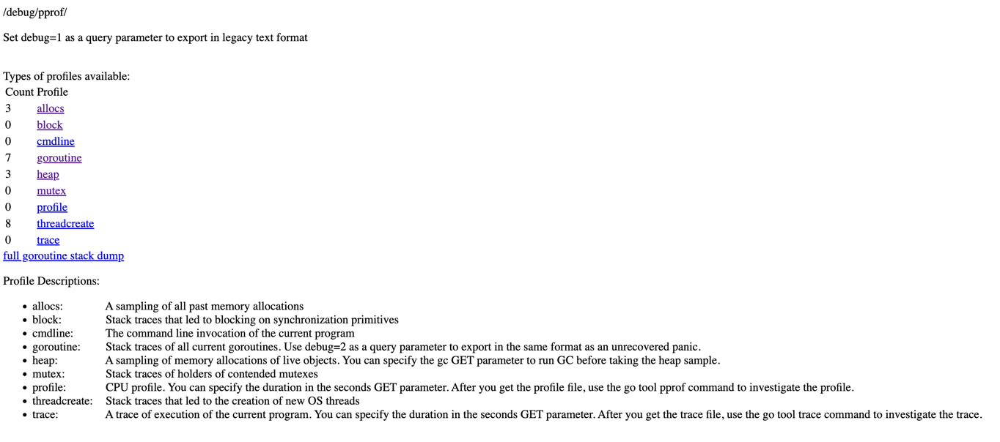
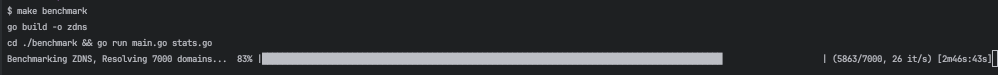

# Benchmark

This directory contains the benchmarking code for ZDNS. This is useful if you want to test out a performance enhancement and have a reproducible test.

By default, `make benchmark` (run from the `zdns` directory) will run ZDNS:
- against 7k domains from the CrUX dataset
- 1k go-routines (ZDNS' default)
- Start a `pprof` server at [`localhost:6060`](http://localhost:6060/debug/pprof/)
  - You can get a CPU, goroutine, memory, and other profiles from this server

### pprof
[pprof](https://github.com/google/pprof/blob/main/doc/README.md) is a tool that can be used to profile Go programs. It can be used to profile CPU, memory, and goroutines. 
The pprof server is started by default when running the benchmark. You can access the pprof server at [`localhost:6060`](http://localhost:6060/debug/pprof/).


Selecting a profile will show you the profile in text format, which isn't super useful for diagnostics.

To get a nice graphical view of a profile, run:
`pprof -png http://localhost:6060/debug/pprof/goroutine > pprof.png`

Replace the `goroutine` in the URL with any of the available profiles to get the graphical view of that profile.

### Benchmark Output
The benchmark will give you a status update to show progress:

At the end of the benchmark, you will see the following output:
```
Benchmark took:                                15.94s
Min resolution time:                           1.49ms
Max resolution time:                           15.03s
Average resolution time:                     341.82ms

Ten longest resolutions:
	www.eghtesad100.ir:                        15.03s
	es.slideshare.net:                         15.02s
	www.magazinevoce.com.br:                   15.02s
	s.minkabu.jp:                              15.02s
	sso.my.gov.ir:                             15.01s
	job.mynavi.jp:                             15.01s
	sexvideos20.com:                           15.01s
	www.daum.net:                              15.01s
	mobile.facebook.com:                       15.01s
	my.gov.ir:                                 15.00s

Domains resolved successfully:              6849/7000
Domains that timed out:                             4
	cricbet99.win
	fr.zalando.be
	giris.turkiye.gov.tr
	www.amazon.ae

Domains that failed:                              147

	0gomovies.la:                            NXDOMAIN
	1qby-rjuv1r--api.dl-api.xyz:             NXDOMAIN
	adliran.ir:                              SERVFAIL
	...
```

### Benchmark Runtimes
Many things can affect the runtime of the benchmark. It's our intention that this be used as a relative benchmark to perform A/B testing of before/after a modification to ZDNS.
Here are some examples of how long it takes to run the benchmark on different machines, your results may vary:

MacBook Air (M2, 2022) 8 cores (4 performance and 4 efficiency) over WiFi - 348.36 sec.
Ubuntu VM 22 cores with 1 Gb/s wired connection                           -  15.94 sec.

If you have a slower machine, feel free to modify the `linesOfInput` constant in `benchmark/main.go` to reduce the number of domains to resolve.
You can also add a `--threads=X` argument to use less go-routines. It will still be valid for A/B testing as a relative comparison.